# Incident Playbook Simulator (PoC)

## Overview

A minimal incident-response PoC that:

- Plans remediation steps with an LLM (Gemini) or deterministic fallback.
- Retrieves evidence (playbooks, metrics, logs) via MCP mock tools.
- Decides route (executor / HITL / summarizer).
- Executes actions (scale/rollback/clear) and produces a concise summary.
- Emits traces (JSONL) and aggregated/scoring metrics for evaluation.

---

## Architecture

```mermaid
flowchart TD
    CLI[CLI: main.py / --batch] -->|alert ids| LangGraph[LangGraph App]

    %% Conexión explícita del grafo con los nodos
    LangGraph --> Planner

    subgraph Nodes
        Planner --> Retriever --> Decision
        Decision -->|low risk| Executor
        Decision -->|high risk| HITL -->|approved| Executor
        Decision -->|no action| Summarizer
        HITL -->|rejected| Summarizer
        Executor --> Summarizer
    end

    %% Comunicación paralela con MCP
    Retriever -->|search/get/query| MCP[MCP Server 'mock']
    Executor -->|tool calls| MCP
    MCP -->|fixtures| Data[mcp_server/sample_data]
```



---

## Setup

### Requirements
- Python 3.11+
- Virtual environment (`venv`)
- Access to [Google Gemini API](https://ai.google.dev/) (if `USE_LLM=true`).

### Installation
```bash
# Clone the repository
git clone https://github.com/your-org/incident-playbook-simulator_poc.git
cd incident-playbook-simulator_poc

# Create virtual environment
python -m venv .venv
source .venv/bin/activate  # (Linux/macOS)
.venv\Scripts\activate     # (Windows PowerShell)

# Install dependencies
pip install -r requirements.txt
```

### Configuration
- Create an **.env** file in ../incident-playbook-simulator_poc :

Google Gemini (default)
```bash
# Enable/disable LLM
SIM_USE_LLM=true

# Select provider
LLM_PROVIDER=google

# Google Gemini credentials and model
GOOGLE_API_KEY="your_google_key_here"   # or API_KEY
GEMINI_MODEL=gemini-2.0-flash-001       # or MODEL

# Logging
LOG_LEVEL=INFO
LOG_FILE_LEVEL=INFO
LOG_JSON=false
```

OpenAI
```bash
SIM_USE_LLM=true
LLM_PROVIDER=openai

OPENAI_API_KEY="your_openai_key_here"
OPENAI_MODEL=gpt-4o-mini

LOG_LEVEL=INFO
LOG_FILE_LEVEL=INFO
LOG_JSON=false
```

Anthropic
```bash
SIM_USE_LLM=true
LLM_PROVIDER=anthropic

ANTHROPIC_API_KEY="your_anthropic_key_here"
ANTHROPIC_MODEL=claude-3-5-sonnet-latest

LOG_LEVEL=INFO
LOG_FILE_LEVEL=INFO
LOG_JSON=false
```

Notes
- Switching provider is a config-only change via `LLM_PROVIDER`.
- If the selected provider lacks API key, the LLM will be disabled gracefully and the app will fall back to deterministic logic.
- For Google, `GEMINI_MODEL` can also be set via `MODEL`, and `GOOGLE_API_KEY` via `API_KEY` (backward-compatible).

-- **LOG_LEVEL**:
- **INFO**     → General runtime information (normal operations, key events).
- **DEBUG**    → Very detailed logs for developers (all internals, step-by-step).
- **WARNING**  → Something unexpected happened, but execution continues.
- **ERROR**    → An error occurred, some functionality may be affected.
- **CRITICAL** → Severe error, the program may not be able to continue.

-- **LOG_FILE_LEVEL**:
- **INFO**     → Saves general information about execution flow to file.
- **DEBUG**    → Full detailed logs saved to file (useful for debugging history).
- **WARNING**  → Logs warnings that should be reviewed but are not blocking.
- **ERROR**    → Logs errors that need fixing to maintain expected behavior.
- **CRITICAL** → Logs only severe issues that may crash or halt the system.

-- **LOG_JSON**:
- **false** → Logs are written in **plain text** (human-friendly format, default).
- **true**  → Logs are written in structured **JSON format** (machine-readable, useful for ingestion).


---

## Usage

### Run a single alert
```bash
python main.py --alert ALERT-1001
```

### Run in batch mode (all scenarios in `eval/scenarios.json`)
```bash
python main.py --batch
```

### Scoring & Evaluation
```bash
python -m utils.scoring --traces ./reports/traces --expected ./eval/expected_actions.json --out ./reports/score.json
```

### MCP over HTTP (optional, recommended)

By default, the app uses MCP over stdio to communicate with the local mock MCP server. You can switch to a simple HTTP transport to simplify client/server wiring.

Run the HTTP MCP server in one terminal:

```bash
source .venv/bin/activate
python3 -m mcp_server.http_server --host 127.0.0.1 --port 8765
```

Then, in another terminal, configure the client and run the app:

```bash
source .venv/bin/activate
export MCP_TRANSPORT=http
export MCP_SERVER_URL=http://127.0.0.1:8765

python3 main.py --batch
```

Notes
- MCP_TRANSPORT=stdio (default) keeps legacy stdio mode.
- MCP_TRANSPORT=http requires MCP_SERVER_URL (e.g., http://127.0.0.1:8765).
- The HTTP server is a lightweight wrapper over the same tool functions defined in `mcp_server/server.py`.

### Acceptance validation
To validate acceptance criteria end-to-end (ensures ALERT-1001 → executor/scale_instance and ALERT-1002 → HITL/rollback_deployment):

```bash
python3 main.py --batch
python3 utils/acceptance_check.py
```

---

## Outputs

- **reports/traces/** → JSONL traces per run.
- **reports/metrics.json** → aggregated metrics.
- **reports/score.json** → scoring report after evaluation.

Example metrics:
```json
{
  "runs": 3,
  "autonomy_rate": 0.66,
  "hitl_rate": 0.33,
  "retrieval_relevance_rate": 0.5,
  "action_correctness_rate": 1.0
}
```

---

## Project Structure

```
incident-playbook-simulator_poc/
├── orchestrator/
│   ├── nodes/                 # Planner, Retriever, Decision, Executor, Summarizer
│   ├── mcp_tools.py           # Mock MCP tool implementations
│   ├── config.py              # Global configuration
│   └── graph.py               # LangGraph orchestration
├── prompts/                   # Prompt templates for LLM
├── eval/
│   ├── scenarios.json         # Batch scenarios
│   └── expected_actions.json  # Expected actions and playbook keywords for scoring
├── reports/                   # Output traces & scoring
├── utils/
│   ├── logging_utils.py       # Correlation ID + structured logging
│   ├── policy.py              # Configurable decision policy loader/evaluator
│   └── scoring.py             # Evaluation metrics
├── main.py                    # CLI entrypoint
├── sample_data/
│   └── decision_policy.json   # Rules to drive decision routing and proposed actions
└── README.md                  # Documentation
```

---

## Demo Scenarios

- **ALERT-1001**: CPU saturation on DB → auto scale instance.
- **ALERT-1002**: HTTP 500 spike post-deploy → HITL approval + rollback.
- **ALERT-2000**: Latency anomaly → summarization only (additional scenario).

---

## ✅ Definition of Done (Acceptance Criteria)

The PoC is considered **done** when the following acceptance criteria are met:

- End-to-end runs succeed for **2 scenarios** (`ALERT-1001` and `ALERT-1002`).

- Reports are generated under `reports/`:
  - `reports/traces/` contains JSONL execution traces.
  - `reports/metrics.json` contains aggregated metrics.
  - `reports/score.json` contains scoring evaluation.

- Scoring shows the four success metrics:
  - **Autonomy rate**
  - **HITL rate**
  - **Retrieval relevance**
  - **Action correctness**

- Logging includes correlation IDs and tool call traces.

### 🔄 Running the Acceptance Test (End-to-End)

1. Ensure you have your virtual environment activated and dependencies installed:
   ```powershell
   .\.venv\Scripts\Activate.ps1
   pip install -r requirements.txt

2. Configure your .env file with the necessary environment variables (e.g., SIM_USE_LLM, logging, etc.).

3. Run the acceptance script using PowerShell:

   ```powershell
   pwsh -ExecutionPolicy Bypass -File .\acceptance.ps1

This script will:

- Execute scenarios (ALERT-1001, ALERT-1002, and optionally ALERT-2000).
- Generate traces in reports/traces/.
- Aggregate metrics into reports/metrics.json.
- Run the scoring utility (utils/scoring.py) comparing against eval/expected_actions.json.
- Save results in reports/score.json.

4. Review the outputs:

- **reports/metrics.json** → aggregated metrics
- **reports/score.json** → success metrics and per-scenario scoring
- **reports/traces/** → JSONL traces per execution

If all criteria above are satisfied, the PoC has achieved its Definition of Done ✅.

---

## Configurable Decision Policy

The decision routing and proposed actions are driven by a JSON policy, allowing you to add new scenarios without changing code.

- Policy file (default): `sample_data/decision_policy.json`
- Override with environment variable: `DECISION_POLICY_PATH=/path/to/policy.json`

Structure:

```json
{
  "default": { "route": "summarizer", "risk": "none", "justification": "No clear action; produce summary." },
  "rules": [
    {
      "when": { "alert_id": "ALERT-1002" },
      "enforce": true,
      "decision": {
        "route": "hitl",
        "risk": "high",
        "justification": "HITL required for post-deploy 500 spikes in this PoC."
      },
      "proposed_action": { "action": "rollback_deployment", "service": "checkout-api", "payload": {} }
    },
    {
      "when": { "alert_id": "ALERT-1001" },
      "enforce": true,
      "decision": {
        "route": "executor",
        "risk": "low",
        "justification": "CPU high on db01; safe to scale."
      },
      "proposed_action": { "action": "scale_instance", "service": "db01", "payload": { "target": 2 } }
    }
  ]
}
```

Notes:
- The first matching rule wins.
- If `enforce` is true, the rule overrides any LLM suggestion.
- `proposed_action` is normalized to include both `service` and `service_name`, and its `payload` is merged with them for executor compatibility.

### Extending rules by service, severity, and tags
You can extend `when` conditions beyond `alert_id`. For example, by including `service`, `severity`, or `tags` baked into your alert inputs.

Examples:

```jsonc
{
  "rules": [
    // Route all checkout-api rollbacks through HITL
    {
      "when": { "service": "checkout-api" },
      "enforce": true,
      "decision": { "route": "hitl", "risk": "high", "justification": "High-risk customer-facing API." },
      "proposed_action": { "action": "rollback_deployment" }
    },

    // Auto-execute for low severity cache incidents
    {
      "when": { "service": "cache", "severity": "low" },
      "enforce": false,
      "decision": { "route": "executor", "risk": "low", "justification": "Low severity cache issue." },
      "proposed_action": { "action": "clear_cache", "payload": { "scope": "global" } }
    },

    // Tag-based routing: any incident tagged as `data-migration`
    {
      "when": { "tags": ["data-migration"] },
      "enforce": true,
      "decision": { "route": "hitl", "risk": "high", "justification": "Data migration requires approval." }
    }
  ]
}
```

Implementation detail: Policy matching supports multiple conditions with AND semantics across provided fields:

- `alert_id`: exact match
- `service` / `service_name`: exact match
- `severity`: exact match
- `tags`: requires non-empty intersection between rule tags and alert tags

You can combine these in `when` to target very specific scenarios. The first matching rule applies.

---

## Authors

- **Leonardo Serrano** – Data Engineer / Generative AI Enthusiast - [Email](mailto:leonardo.serrano@globallogic.com)
- **Juan Rella** – Sofware Architect - [Email](mailto:juan.rella@globallogic.com)

---
