# Incident Playbook Simulator (PoC)

## Overview

A minimal incident-response PoC that:

- Plans remediation steps with an LLM (Gemini) or deterministic fallback.
- Retrieves evidence (playbooks, metrics, logs) via MCP mock tools.
- Decides route (executor / HITL / summarizer).
- Executes actions (scale/rollback/clear) and produces a concise summary.
- Emits traces (JSONL) and aggregated/scoring metrics for evaluation.

---

## Architecture

```mermaid
flowchart TD
    CLI[CLI: main.py / --batch] -->|alert ids| LangGraph[LangGraph App]

    %% Conexión explícita del grafo con los nodos
    LangGraph --> Planner

    subgraph Nodes
        Planner --> Retriever --> Decision
        Decision -->|low risk| Executor
        Decision -->|high risk| HITL --> Executor
        Decision -->|no action| Summarizer
        Executor --> Summarizer
    end

    %% Comunicación paralela con MCP
    Retriever -->|search/get/query| MCP[MCP Server 'mock']
    Executor -->|tool calls| MCP
    MCP -->|fixtures| Data[mcp_server/sample_data]
```



---

## Setup

### Requirements
- Python 3.11+
- Virtual environment (`venv`)
- Access to [Google Gemini API](https://ai.google.dev/) (if `USE_LLM=true`).

### Installation
```bash
# Clone the repository
git clone https://github.com/your-org/incident-playbook-simulator.git
cd incident-playbook-simulator

# Create virtual environment
python -m venv .venv
source .venv/bin/activate   # (Linux/macOS)
.venv\Scripts\activate    # (Windows PowerShell)

# Install dependencies
pip install -r requirements.txt
```

### Configuration
- Edit `orchestrator/config.py` to set:
  - `USE_LLM=True` or `False`
  - `GEMINI_MODEL="gemini-2.0-flash-001"` (or another available model)

- API key:
```powershell
$env:GOOGLE_API_KEY="your_api_key_here"
```

- .env file:
```bash
# Model info
SIM_USE_LLM=true/false
LLM_PROVIDER=google
MODEL=gemini-2.0-flash-001
API_KEY="your_api_key_here"

# Logging
LOG_LEVEL=INFO/DEBUG/WARNING/ERROR/CRITICAL
LOG_FILE_LEVEL=DEBUG/INFO/WARNING/ERROR/CRITICAL
LOG_JSON=false/true
```

-- **LOG_LEVEL**:
- **DEBUG**    → Very detailed logs for developers (all internals, step-by-step).
- **INFO**     → General runtime information (normal operations, key events).
- **WARNING**  → Something unexpected happened, but execution continues.
- **ERROR**    → An error occurred, some functionality may be affected.
- **CRITICAL** → Severe error, the program may not be able to continue.

-- **LOG_FILE_LEVEL**:
- **DEBUG**    → Full detailed logs saved to file (useful for debugging history).
- **INFO**     → Saves general information about execution flow to file.
- **WARNING**  → Logs warnings that should be reviewed but are not blocking.
- **ERROR**    → Logs errors that need fixing to maintain expected behavior.
- **CRITICAL** → Logs only severe issues that may crash or halt the system.

-- **LOG_JSON**:
- **true**  → Logs are written in structured **JSON format** (machine-readable, useful for ingestion).
- **false** → Logs are written in **plain text** (human-friendly format, default).


---

## Usage

### Run a single alert
```bash
python main.py --alert ALERT-1001
```

### Run in batch mode (all scenarios in `eval/scenarios.json`)
```bash
python main.py --batch
```

### Scoring & Evaluation
```bash
python -m utils.scoring --traces ./reports/traces --expected ./eval/expected_actions.json --out ./reports/score.json
```

---

## Outputs

- **reports/traces/** → JSONL traces per run.
- **reports/metrics.json** → aggregated metrics.
- **reports/score.json** → scoring report after evaluation.

Example metrics:
```json
{
  "runs": 3,
  "autonomy_rate": 0.66,
  "hitl_rate": 0.33,
  "retrieval_relevance_rate": 0.5,
  "action_correctness_rate": 1.0
}
```

---

## Project Structure

```
incident-playbook-simulator/
├── orchestrator/
│   ├── nodes/                 # Planner, Retriever, Decision, Executor, Summarizer
│   ├── mcp_tools.py           # Mock MCP tool implementations
│   ├── config.py              # Global configuration
│   └── graph.py               # LangGraph orchestration
├── prompts/                   # Prompt templates for LLM
├── eval/
│   ├── scenarios.json         # Batch scenarios
│   └── expected_actions.json  # Expected actions and playbook keywords for scoring
├── reports/                   # Output traces & scoring
├── utils/
│   ├── logging_utils.py       # Correlation ID + structured logging
│   └── scoring.py             # Evaluation metrics
├── main.py                    # CLI entrypoint
└── README.md                  # Documentation
```

---

## Demo Scenarios

- **ALERT-1001**: CPU saturation on DB → auto scale instance.
- **ALERT-1002**: HTTP 500 spike post-deploy → HITL approval + rollback.
- **ALERT-2000**: Latency anomaly → summarization only.

---

## ✅ Definition of Done (Acceptance Criteria)

The PoC is considered **done** when the following acceptance criteria are met:

- End-to-end runs succeed for at least **2 scenarios** (`ALERT-1001` and `ALERT-1002`).

- Reports are generated under `reports/`:
  - `reports/traces/` contains JSONL execution traces.
  - `reports/metrics.json` contains aggregated metrics.
  - `reports/score.json` contains scoring evaluation.

- Scoring shows the four success metrics:
  - **Autonomy rate**
  - **HITL rate**
  - **Retrieval relevance**
  - **Action correctness**

- Logging includes correlation IDs and tool call traces.

### 🔄 Running the Acceptance Test (End-to-End)

1. Ensure you have your virtual environment activated and dependencies installed:
   ```powershell
   .\.venv\Scripts\Activate.ps1
   pip install -r requirements.txt

2. Configure your .env file with the necessary environment variables (e.g., SIM_USE_LLM, logging, etc.).

3. Run the acceptance script using PowerShell:

   ```powershell
   pwsh -ExecutionPolicy Bypass -File .\acceptance.ps1

This script will:

- Execute scenarios (ALERT-1001, ALERT-1002, and optionally ALERT-2000).
- Generate traces in reports/traces/.
- Aggregate metrics into reports/metrics.json.
- Run the scoring utility (utils/scoring.py) comparing against eval/expected_actions.json.
- Save results in reports/score.json.

4. Review the outputs:

- **reports/metrics.json** → aggregated metrics
- **reports/score.json** → success metrics and per-scenario scoring
- **reports/traces/** → JSONL traces per execution

If all criteria above are satisfied, the PoC has achieved its Definition of Done ✅.

---
